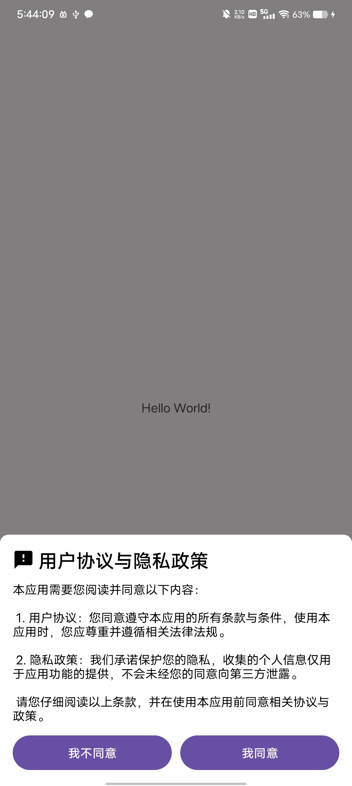

# Initialize Popup

This is an example of a user agreement and privacy agreement pop-up when a user launches the app for the first time

## Use the library
[XPopup](https://github.com/junixapp/XPopup)

## Preview

